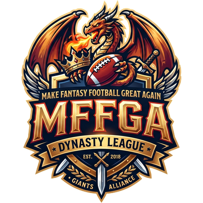

<div align="center">
  

**MFFGA — Dynasty League Page**

Custom Sleeper league site for the MFFGA dynasty league, deployed at [mffga.win](https://www.mffga.win).

</div>

> Forked from the [(Unofficial) Sleeper League Page Template](https://github.com/nmelhado/league-page) and heavily extended for dynasty-format use. Original credit to Nicholas Melhado for the base.

---

## What's in here

A full-featured dynasty league site that pulls live data from the Sleeper API and adds tooling around it. Core features:

**League info**
- Live rosters with FantasyCalc total-value badges, expandable benches, and a flattened layout (no division banners)
- **Value Rankings** panel — positional stacked-bar leaderboard with league-average marker, per-team % vs avg, and a *Include rookie picks* toggle that recomputes totals + sort order on the fly
- **Historical Matchups** — year dropdown back through `previous_league_id`; each past season renders as a dense per-week × per-manager grid with W/L color, opponent avatars, and PF / PA / Avg / High summary columns
- Manager pages with all-time trade history (resolved by managerID, not the brittle current-season rosterID), favorite-team logos, contact icons, and rebuild-mode badges
- **Constitution** + **Dynasty 101** primer — both markdown-driven with sticky TOC, active-section tracking, and a unified blue/orange/green callout palette

**Trade tooling**
- **Trade Calculator** with FantasyCalc values, positional analysis, and a *suggestion engine* that proposes single-piece adders (and 2-piece combos) to bring lopsided trades within 5% of fair
- **Click any trade card → opens in the calculator with the trade pre-loaded.** Picks resolve to their actual draft slot via `slot_to_roster_id` / `draft_order` (e.g. `2026 Pick 1.07`), not generic `2026 1st`
- Trade cards display the specific pick slot inline (`Pick 1.07`)
- Player & pick values page with sortable filters and Sleeper player thumbnails

**Knowledge layer**
- **Dynasty KB** — 50+ markdown articles, full-text search across title + body, sticky category sidebar with active-article highlighting, per-article match counts, and a fixed light reading panel
- **Trades & Waivers** tab includes a *Manager Activity* panel showing all-time trade/waiver counts per team, sorted by total activity
- **Helpful Resources & News** with an inline link editor (add / remove / reorder)

**Editing (password-gated)**
- Constitution, Dynasty 101, KB articles, and the Resources link list can all be edited live without a redeploy
- Edit button → password prompt → 8-hour session cookie → in-place markdown textarea pre-filled with the current content
- Persisted in Upstash Redis (Vercel marketplace KV); falls back to in-memory dev store when env vars are missing
- "Reset to default" wipes the override and restores the bundled source

**Other touches**
- Player thumbnails (Sleeper CDN) on roster rows, trade cards, value tables, and trade-calc autocompletes
- Mobile compaction tuned for ≤768px (smaller player rows, condensed Value Rankings, banner removal)
- Light reading panels stay light even in system dark mode (Constitution / Dynasty 101 / KB)
- ChatGPT-style emoji headers across content pages

## Tech stack

- [SvelteKit](https://svelte.dev/docs/kit) with Svelte 5 runes mode
- [`@sveltejs/adapter-vercel`](https://kit.svelte.dev/docs/adapter-vercel) — deployed on Vercel
- [Sleeper API](https://docs.sleeper.app/) — rosters, transactions, drafts, matchups, brackets
- [FantasyCalc API](https://api.fantasycalc.com/) — dynasty player + pick values (cached for 12h via a Vercel cron-warmed CDN cache)
- [`marked`](https://marked.js.org/) — markdown rendering for KB, Constitution, Dynasty 101
- [`@upstash/redis`](https://upstash.com/) — KV store for editor overrides + sessions
- [SMUI](https://sveltematerialui.com/) — Material design components (data tables, buttons, etc.)

## Setup

### League data

`src/lib/utils/leagueInfo.js` — change:

- `leagueID` to your Sleeper league ID
- `leagueName`, `dues`, `dynasty` to fit your league
- `homepageText` for your league intro
- `managers` array — one entry per manager with `name`, `managerID` (Sleeper user_id), `bio`, `photo`, optional `favoriteTeam` (lowercase NFL abbreviation), `mode` (`"Win Now"` / `"Rebuild"`), and `preferredContact` (`"Sleeper"`, `"Discord"`, `"Email"`, etc.)

### Environment variables (Vercel)

| Var | Purpose |
| --- | --- |
| `EDIT_PASSWORD` | Shared password for the edit button on Constitution / Dynasty 101 / KB / Resources |
| `UPSTASH_REDIS_REST_URL` | KV endpoint (auto-injected when you install Upstash Redis from Vercel Marketplace) |
| `UPSTASH_REDIS_REST_TOKEN` | KV token (auto-injected) |
| `VITE_CONTENTFUL_SPACE` | (Optional, for blog) Contentful space ID |
| `VITE_CONTENTFUL_ACCESS_TOKEN` | (Optional, for blog) Contentful management token |
| `VITE_CONTENTFUL_CLIENT_ACCESS_TOKEN` | (Optional, for blog) Contentful delivery token |

### Cron

`vercel.json` runs the FantasyCalc value cache-warmer once a day at 06:00 UTC. The endpoint (`/api/fetch_player_pick_values`) is set with a 12h CDN cache, so a single warm-up keeps values fresh through the day.

### Local dev

```sh
npm install
npm run dev
```

Without Upstash env vars, the editor uses an in-memory store — saves persist for the lifetime of the dev process and won't be visible to other users.

### Deploy

Pushing to `master` auto-deploys to Vercel. For ad-hoc deploys, `vercel --prod` from the repo root.

## License

MIT — see [LICENSE](./LICENSE).
